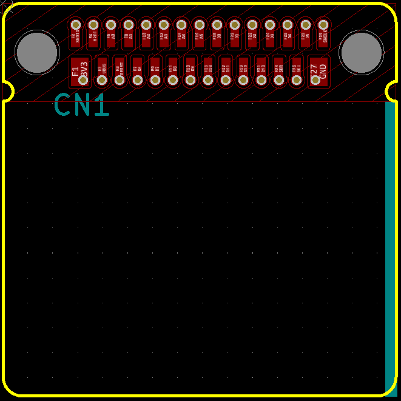

# cad-template

This repository is a template library of Leafony PCB design.

## Supported CAD tools
* KiCad 5.0.0 or later
* Leafony_Template is for KiCad 5.xx.
* Leafony_Template_V6 is for KiCad 6.xx.

## Usage
### KiCad

1. Open KiCad.
1. `File -> New -> Project` from Template.
1. `Browse` this repository and select Leafony template.

## License
MIT
